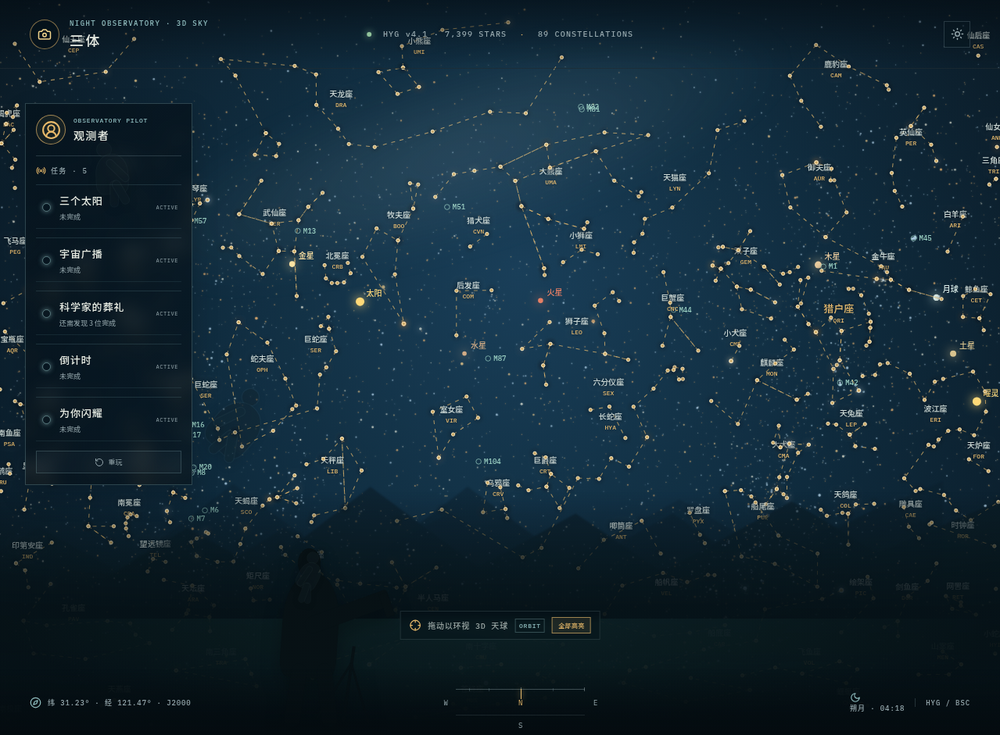

# 三体（Three-Body）天文观测模拟器


> 一款以“三体”叙事氛围为灵感的全屏沉浸式天文观测模拟器。用户可以像操作数字化天文望远镜一样拖动视角探索科学星空，识别星座、观测太阳系天体，并通过跨页面任务体验三颗太阳、宇宙广播、隐藏目标搜索与昼夜观测等互动内容。

## 项目状态

这是一个适合继续扩展和上传到代码仓库的前端项目草稿。当前版本已经完成主要观测界面、任务系统、太阳系模拟、三颗太阳模拟和星际旅行页面。README 中的截图与徽章区域也已预留，后续可以根据仓库地址、作者名称和实际构建体积继续调整。

## 致谢 Manus

特别感谢 [Manus 官方团队](https://manus.im/) 提供的限时免费活动与创作支持。本项目从界面设计、交互逻辑、Three.js 场景、任务系统到项目文档，均由 Manus 完成编写与整理。

Manus 官方地址：[https://manus.im/](https://manus.im/)

## 首页预览



首页采用全屏天球构图：上方为科学星空与星座连线，中部为太阳系天体和星座标注，下方为地平线、方位仪表与观测提示，左侧任务面板用于显示当前任务状态。页面默认展示基于专业星表整理的星点和星座信息，并支持鼠标拖拽进行水平与垂直方向的全天球探索。

## 核心功能

| 功能模块 | 说明 |
| --- | --- |
| 3D 天球观测 | 使用科学星点数据呈现星空，支持鼠标拖拽旋转视角、星座连线、中文名称、英文缩写和天体标注。 |
| 89 个星座 | 默认加载完整星座目录，并提供名称标注、连线显示和视角探索。 |
| 天体交互 | 点击太阳、月球、行星及部分深空天体，可以查看距离、视星等、类型和简介等信息。 |
| 昼夜切换 | 通过太阳/月亮控制切换观测环境，影响星空视觉表现和部分任务的可用条件。 |
| 视觉强度 | 支持“柔和显示”和“全部高亮”两种星座视觉强度。 |
| 三体模拟 | 在“三个太阳”任务中进入独立的 Three.js 三星异常轨道模拟，支持拖拽、缩放、暂停和调速。 |
| 太阳系运转 | 以 3D 轨道仪表形式观察太阳系运行，并承载“宇宙广播”的分阶段互动流程。 |
| 星际旅行 | 从地球前往目标行星，展示飞船视角、航行进度、环境日志、目标导航和抵达后的行星近距离环绕观察。 |
| 截图任务 | 使用相机按钮截取观测站画面，并在图片右下角写入精确到秒的本地时间。 |
| 流星雨效果 | 在特定任务完成后触发短时流星雨，作为观测任务的视觉反馈。 |

## 五项互动任务

任务状态会保存在浏览器本地存储中，跨页面跳转后仍然保持。点击“重玩”可以清除任务完成状态、阶段授权、进度和临时庆祝效果。

| 顺序 | 任务 | 完成条件 |
| --- | --- | --- |
| 1 | 三个太阳 | 从首页点击三个太阳外观的虚拟天体，进入 `/solar-triad` 完成异常轨道观测，并通过“完成观测并返回”回到观测站。 |
| 2 | 宇宙广播 | 必须在白天观测模式下点击太阳，进入太阳系页面后再次点击太阳，完成逐字通信、“不要回答”三次和最终“回答”流程。 |
| 3 | 科学家的葬礼 | 在全屏星空中寻找三个低对比度的人形目标；每发现一位目标，其轮廓会立即从画面中移除。 |
| 4 | 倒计时 | 点击相机按钮完成整页截图，图片附带年月日、小时、分钟和秒数时间戳。 |
| 5 | 为你闪耀 | 仅在夜间观测模式下，将视觉强度从“柔和显示”切换至“全部高亮”达到当前设定阈值。 |

## 页面与路由

| 路由 | 页面用途 |
| --- | --- |
| `/` | 三体主观测站、全屏 3D 天球、任务面板和天体详情。 |
| `/solar-triad` | 三颗太阳的异常轨道 Three.js 模拟。 |
| `/solar-system` | 太阳系 3D 运转仪表和宇宙广播任务流程。 |
| `/travel/:planetId` | 地球至目标行星的沉浸式星际旅行与抵达观察。 |

## 技术栈

项目使用 React 19 构建界面，使用 TypeScript 进行类型约束，使用 Vite 提供开发服务器和构建能力，使用 Three.js 实现三体轨道、太阳系和行星近景等 3D 场景，使用 Wouter 完成前端路由，使用 Tailwind CSS 4 与自定义 CSS 构建仪器舱风格界面，并使用 `html2canvas` 完成观测截图。

项目当前为静态前端应用，不依赖后端数据库。任务进度、昼夜状态授权和截图任务完成状态主要通过浏览器的 `localStorage` 与 `sessionStorage` 管理。

## 本地运行

### 环境要求

建议使用 Node.js 22 或更高版本，并安装 pnpm。安装依赖后即可启动开发服务器。

```bash
git clone <你的仓库地址>
cd stargazer-observatory
pnpm install
pnpm dev
```

启动后访问终端输出的本地地址，通常为 `http://localhost:3000`。

### 类型检查与构建

```bash
pnpm check
pnpm build
pnpm preview
```

其中，`pnpm check` 用于执行 TypeScript 检查，`pnpm build` 用于生成生产构建产物，`pnpm preview` 用于在本地预览构建结果。

## 项目结构

```text
stargazer-observatory/
├── client/
│   ├── index.html
│   └── src/
│       ├── components/       # 3D 场景、界面和通用组件
│       ├── contexts/         # 主题和全局上下文
│       ├── hooks/            # 可复用 React Hooks
│       ├── lib/              # 工具函数
│       ├── pages/            # 首页、太阳系、三体和星际旅行页面
│       ├── App.tsx           # 路由与应用入口
│       ├── index.css         # 全局视觉系统和动画
│       └── main.tsx          # React 挂载入口
├── docs/
│   └── homepage.png          # README 首页截图
├── server/                   # 静态模板兼容用占位目录
├── shared/                   # 共享类型兼容用占位目录
├── LICENSE                   # MIT 许可证
├── README.md
├── package.json
└── vite.config.ts
```

## 许可证

本项目采用 MIT License。你可以自由使用、复制、修改、合并、发布、再许可和销售本项目代码，但需要在副本中保留原许可证和版权声明。完整条款请见 [LICENSE](LICENSE)。

## 免责声明

本项目是用于交互体验和天文科普展示的模拟器，不构成专业天文观测软件、科学计算工具或真实航天任务规划系统。星空显示和轨道动画主要服务于沉浸式体验，具体天体数据、视位置和物理模型不应直接用于科研或工程决策。
